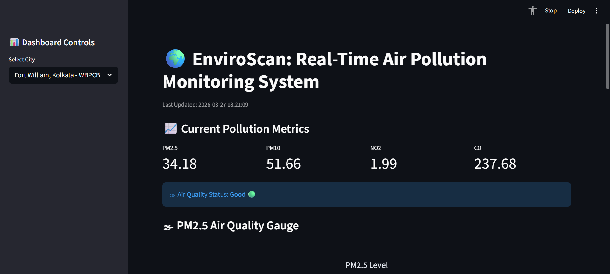
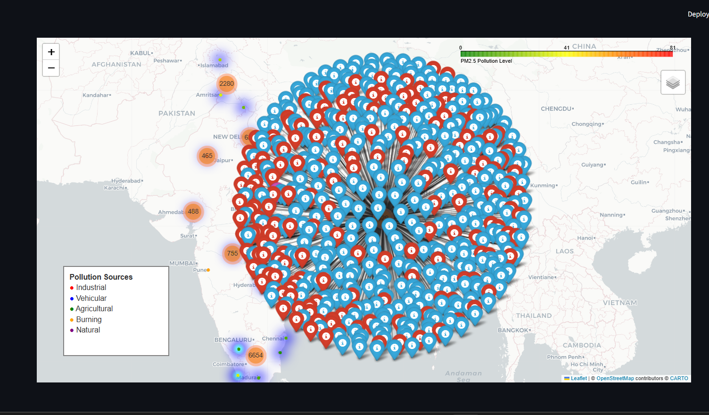
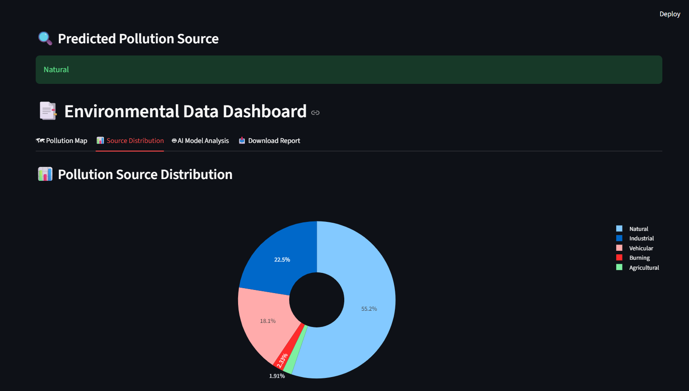
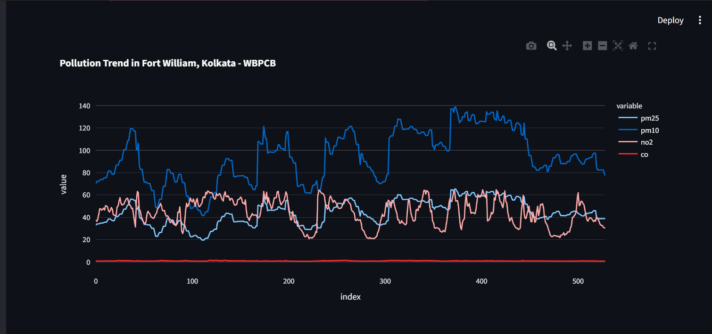
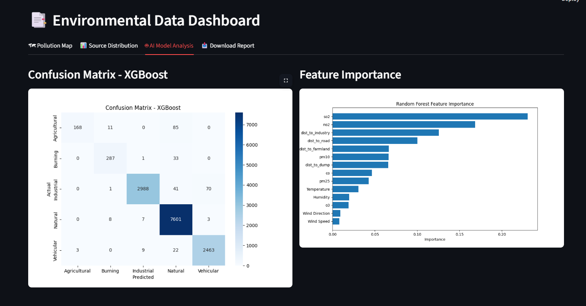

# EnviroScan: AI-Based Pollution Source Identification System

## Project Overview

**EnviroScan** is an AI, data science, and geospatial analytics project that identifies **sources of air pollution** using machine learning and visualizes them through interactive dashboards and maps.

The system integrates **pollution data, weather data, and geographic features** to classify pollution sources such as:

- Agricultural
- Burning
- Industrial
- Natural
- Vehicular

It also provides **heatmaps, hotspot detection, and a Streamlit dashboard** for interactive analysis.

---

## Problem Statement

Most pollution monitoring systems only show pollutant levels but do not answer:

> **"What is the source of pollution?"**

### Challenges

- No labeled dataset for pollution sources
- Multiple pollution sources overlap
- Lack of intelligent visualization systems

---

## Objectives

- Predict pollution sources using ML models
- Identify high pollution zones (hotspots)
- Perform geospatial analysis using maps
- Build an interactive dashboard
- Provide insights for environmental monitoring

---

## Project Architecture

The project is divided into **6 major modules**:

1. Data Collection
2. Data Preprocessing
3. Data Labeling
4. Model Training and Evaluation
5. Geospatial Visualization
6. Dashboard Development

---

## Dataset Description

### Data Sources

- **OpenAQ API** -> Pollution data (PM2.5, PM10, NO2, CO)
- **OpenWeatherMap API** -> Weather data
- **OpenStreetMap (OSMnx)** -> Roads and industries

### Features

- Pollutants: PM2.5, PM10, NO2, CO
- Location: Latitude, Longitude, City
- Distance to roads
- Distance to industries
- Weather attributes

---

## Data Preprocessing

- Missing value handling
- Duplicate removal
- Data cleaning and formatting
- Dataset merging
- Feature engineering

---

## Source Labeling

Since real labels are unavailable, **rule-based labeling** is used to assign pollution-source categories:

- Agricultural
- Burning
- Industrial
- Natural
- Vehicular

These labels are derived from pollutant patterns, nearby geographic features, and environmental conditions.

---

## Machine Learning Models

### Implemented Models

- Decision Tree
- Random Forest (Best performance)
- XGBoost

### Workflow

1. Data preprocessing
2. Train-test split (80:20)
3. Model training
4. Prediction
5. Model saving using Joblib

---

## Model Evaluation

- Accuracy
- Precision
- Recall
- F1-Score
- Confusion Matrix

---

## Geospatial Analysis

### Features

- Pollution heatmaps
- Hotspot detection
- Risk zone identification
- Source-based markers

### Tools

- Folium
- Custom map layers

---

## Dashboard (Streamlit)

Interactive dashboard built using **Streamlit**.

### Features

- City selection
- Pollution visualization
- Source prediction
- Plotly charts
- Map integration

### Dashboard Screenshots







---

## Project Structure

```text
Environ_Scan_Project/
|
|-- Dataset/
|   |-- Final_Dataset_Cleaned.csv
|   |-- Final_Dataset_Labeled.csv
|   |-- Final_Dataset_Labeled_Balanced.csv
|   |-- Final_Predictions.csv
|   |-- Location_Features_Dataset.csv
|   |-- Main_Pollution_Dataset.csv
|   |-- Pollution_Weather_Dataset.csv
|   |
|   |-- city_pollution/
|   |   |-- Ahmedabad.csv
|   |   |-- Amritsar.csv
|   |   |-- Bengaluru.csv
|   |   |-- Chandigarh.csv
|   |   |-- Chennai.csv
|   |   |-- Delhi.csv
|   |   |-- Eloor.csv
|   |   |-- Gurugram.csv
|   |   |-- Hyderabad.csv
|   |   |-- Jalna.csv
|   |   |-- Kolkata.csv
|   |   |-- Madurai.csv
|   |   |-- Mumbai.csv
|   |   |-- Mysuru.csv
|   |   |-- Nagpur.csv
|   |   |-- Noida.csv
|   |   |-- Puducherry.csv
|   |   |-- Pune.csv
|   |   |-- Srinagar.csv
|   |   `-- Vijayawada.csv
|   |
|   `-- Script/
|       |-- Dataset_Cleaning.py
|       |-- Data_Labeling.py
|       |-- final_dataset.py
|       |-- location_collection.py
|       |-- pollution_collection.py
|       `-- weather_pollution_collection.py
|
|-- Images/
|   |-- Dashboard/
|   |   `-- .gitkeep
|   |-- Random_forest.png
|   `-- Matrix-XGBoost.png
|
|-- Models/
|   |-- DecisionTree.joblib
|   |-- RandomForest.joblib
|   |-- XGBoost.joblib
|   `-- LabelEncoder.joblib
|
|-- ModelScript/
|   |-- EnviroScan_Model.py
|   |-- Features_Importance.png
|   |-- DT_Confusion_Matrix.png
|   |-- RF_Confusion_Matrix.png
|   `-- XGBOOST_Confusion_Matrix.png
|-- Model_5_Geospatial/
|   |-- html_exports/
|   |   `-- pollution_map.html
|   |
|   `-- maps/
|       |-- generate_pollution_map.py
|       |-- heatmap_layer.py
|       |-- hotspot_layer.py
|       |-- marker_layer.py
|       |-- pollution.py
|       `-- risk_layer.py
|
|-- Model_6_Dashboard/
|   `-- Dashboard_Enhanced.py
|
|-- .env
|-- .gitignore
|-- LICENSE
`-- Readme.md
```

---

## How to Run

### 1. Install Dependencies

```bash
pip install -r requirements.txt
```

### 2. Configure Environment

1. Copy `.env.example` to `.env`
2. Add your OpenWeather API key to `.env`
3. Get a free API key from: https://openweathermap.org/api

### 3. Train Models (Optional)

```bash
python ModelScript/EnviroScan_Model.py
```

### 4. Run Dashboard

```bash
streamlit run Model_6_Dashboard/Dashboard_Enhanced.py
```

For detailed setup instructions, see [SETUP.md](SETUP.md)

---

## Technologies Used

- Python
- Pandas, NumPy
- Scikit-learn
- XGBoost
- Streamlit
- Plotly
- Folium
- Joblib
- OpenAQ API
- OpenWeatherMap API
- OpenStreetMap (OSMnx)

---

## Limitations

- Rule-based labeling (no real ground truth)
- Multiple pollution sources simplified
- Limited dataset

---

## Future Enhancements

- Real-time API integration
- Deep learning models
- Satellite data usage
- Mobile app integration
- Smart city deployment

---

## Conclusion

EnviroScan combines machine learning, environmental data, and geospatial visualization to identify pollution sources and provide meaningful insights. It can help researchers, governments, and environmental agencies make better decisions for pollution control.
